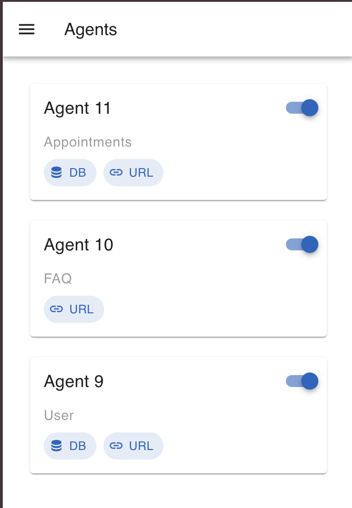
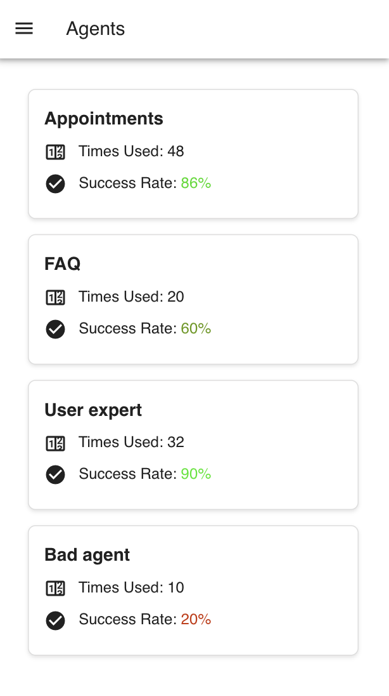
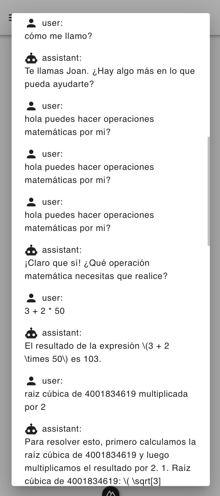

# 🤖 WhatSupport (AI-Powered Customer Support Platform)

A modern, scalable customer support platform that combines intelligent chatbots with agent management capabilities. Built with Nuxt.js, FastAPI, and Supabase.

## ✨ Features

- 🤖 AI-powered chatbot using Mistral AI
- 📱 WhatsApp integration via Twilio
- 👥 Agent management system
- 📊 Real-time statistics and monitoring
- 📅 Google Calendar integration
- 🌐 Multi-language support
- 🎯 Action-based routing system

## 🏗️ Architecture

### Frontend (Nuxt.js)

- Modern Vue.js-based interface with Vuetify
- Real-time agent configuration
- Performance monitoring dashboard
- Conversation thread viewer

### Backend (FastAPI)

- High-performance Python API
- Seamless integration with Mistral AI
- WhatsApp webhook handling
- Google Calendar integration

### Database (Supabase)

- Real-time data synchronization
- Secure authentication
- Scalable data storage

## How to run

1. Clone the repository:

```bash
git clone https://github.com/pausejo/hackathon.git
cd hackathon
```

2. Install the required dependencies and run backend:

```bash
pip install -r requirements.txt
python main.py
```

4. Run the frontend:

```bash
cd front
npm install
npm run dev
```

## 📸 Screenshots






